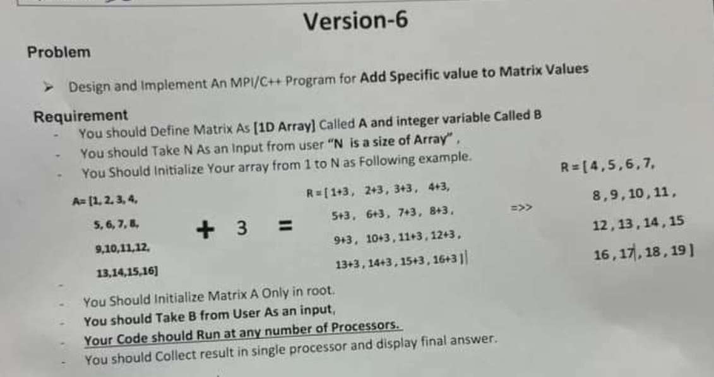

<div align=left>
<h1>
  HPC 'Practical Exams' Solutions
</h1>
  <h5>
    "High Performance Computing" course at FCIS - ASU
</div>
<br>
<br>


<b>Solution :<b>

```C++
#include <iostream>
#include <mpi.h>

using namespace std;

int main()
{
    //On 4 processors 
    MPI_Init(NULL, NULL);

    int rank;
    MPI_Comm_rank(MPI_COMM_WORLD, &rank);


    int arr[200], recvarr[50], processors[4];

    if (rank == 0)
        for (int i = 0; i < 200; i++)
            arr[i] = i + 1;

    MPI_Scatter(arr, 50, MPI_INT, recvarr, 50, MPI_INT, 0, MPI_COMM_WORLD);

    int max = 0;

    for (int i = 0; i < 50; i++)
        if (recvarr[i] > max)
            max = recvarr[i];


    MPI_Gather(&max, 1, MPI_INT, processors, 1, MPI_INT, 0, MPI_COMM_WORLD);

    int final_max = 0;

    if (rank == 0)
    {
        for (int i = 0; i < 4; i++)
            if (processors[i] > final_max)
                final_max = processors[i];

        cout << "Max number in the array is : " << final_max << endl;
    }

    MPI_Finalize();
    return 0;
}
```

<br>
<p align = 'center'>~~~~~~~~~~~~~~~~~~~~~~~~~~~~~~~~~~~~~~~~~~~~~~~~~~~~~~~~~~<p>
<br>

<b>MPI Array Calculation<b>
This program performs a calculation on a given 4x4 array. The array is initially defined as follows:
```C++
[
  4,4,4,4
  6,6,6,6
  0,0,0,0
  1.3, 1.3, 1.3 1.3
]
```

The calculation is performed on each row of the array, using a value provided by the user. The specific operation to be applied on each row is as follows:

- Addition (`+`) on the first row
- Multiplication (`*`) on the second row
- Subtraction (`-`) on the third row
- Division (`/`) on the fourth row

For example, let's assume the user enters the value 3. The result of the calculation will be a modified array:

```C++
[ 4, 4, 4, 4,
  6, 6, 6, 6,
  0, 0, 0, 0,
  1.3, 1.3, 1.3, 1.3]
```
Now, let's take a look at the solution.

<b>Solution:<b>

```C++
#include <iostream>
#include <stdio.h>
#include <cmath>
#include "math.h"
#include <mpi.h>

using namespace std;

int main(int argc, char** argv)
{
    MPI_Init(NULL, NULL);

    int size, rank;
    MPI_Comm_size(MPI_COMM_WORLD, &size);
    MPI_Comm_rank(MPI_COMM_WORLD, &rank);

    //On 4 processors

    float B = 0;
    float arr[16] = { 1,1,1,1,2,2,2,2,3,3,3,3,4,4,4,4 };
    float recv_arr[4];

    if (rank == 0)
    {
        cout << "Please enter the number" << endl;
        cin >> B;
    }

    MPI_Bcast(&B, 1, MPI_FLOAT, 0, MPI_COMM_WORLD);
    MPI_Scatter(arr, 4, MPI_FLOAT, recv_arr, 4, MPI_FLOAT, 0, MPI_COMM_WORLD);


    for (int i = 0; i < 4; i++)
    {
        if (rank == 0)
            recv_arr[i] += B;
        else if (rank == 1)
            recv_arr[i] *= B;
        else if (rank == 2)
            recv_arr[i] -= B;
        else if (rank == 3)
            recv_arr[i] /= B;
    }

    float final_result[16];
    MPI_Gather(recv_arr, 4, MPI_FLOAT, final_result, 4, MPI_FLOAT, 0, MPI_COMM_WORLD);

    if (rank == 0)
    {
        cout << "The matrix result is : \n";

        for (int i = 0; i < 16; i++)
        {
            cout << final_result[i] << setprecision(1) << endl;
        }
    }

    MPI_Finalize();
    return 0;
}
```

<br>
<p align = 'center'>~~~~~~~~~~~~~~~~~~~~~~~~~~~~~~~~~~~~~~~~~~~~~~~~~~~~~~~~~~<p>
<br>


<b>Solution :<b>

```C++
#include <iostream>
#include <mpi.h>
#include <stdio.h>

using namespace std;

int main(int argc, char** argv)
{
	MPI_Init(NULL, NULL);
	int size, rank;
	MPI_Comm_size(MPI_COMM_WORLD, &size);
	MPI_Comm_rank(MPI_COMM_WORLD, &rank);

	int arr[150];
	if (rank == 0)
	{
		for (int i = 0; i < 150; i++)
		{
			arr[i] = i + 1;
		}
	}


	int processors[3] = { 0,0,0 };
	int localCount = 0;
	int local_arr[50];
	int generalCount = 0;

	MPI_Scatter(&arr, 50, MPI_INT, &local_arr, 50, MPI_INT, 0, MPI_COMM_WORLD);

	for (int j = 0; j < 50; j++)
	{
		if (local_arr[j] % 7 == 0)
			localCount++;
	}

	//MPI_Gather(&localCount, 1, MPI_INT, processors, 1, MPI_INT, 0, MPI_COMM_WORLD);
	MPI_Reduce(&localCount, &generalCount, 1, MPI_INT, MPI_SUM, 0, MPI_COMM_WORLD);

	if (rank == 0)
	{
		/*for (int j = 0; j < 3; j++)
			generalCount += processors[j];*/

		printf("The count of numbers divided by 7 is : %d", generalCount);

	}


	MPI_Finalize();
	return 0;
}
```

<br>
<p align = 'center'>~~~~~~~~~~~~~~~~~~~~~~~~~~~~~~~~~~~~~~~~~~~~~~~~~~~~~~~~~~<p>
<br>


<b>Solution :<b>

```C++
#include <iostream>
#include <mpi.h>
#include <stdio.h>
#include <math.h>

using namespace std;

int main(int argc, char** argv)
{
    //On 3 processors "-n 3"
    MPI_Init(NULL, NULL);

    int size, rank;
    MPI_Comm_size(MPI_COMM_WORLD, &size);
    MPI_Comm_rank(MPI_COMM_WORLD, &rank);

    int arr[150];
    int N;

    if (rank == 0)
    {
        for (int i = 0; i < 150; i++)
            arr[i] = i;

        printf("Enter the N\n");
        cin >> N;
    }

    MPI_Bcast(&N, 1, MPI_INT, 0, MPI_COMM_WORLD);

    int recvbuf[50];

    MPI_Scatter(arr, 50, MPI_INT, recvbuf, 50, MPI_INT, 0, MPI_COMM_WORLD);


    int found = 0;
    int The_rank = 0;
    int x = 1;

    for (int i = 0; i < 50; i++)
    {
        if (N == recvbuf[i])
        {
            if (rank == 0)
                x = 0;
            found = rank;
        }
    }

    MPI_Reduce(&found, &The_rank, 1, MPI_INT, MPI_SUM, 0, MPI_COMM_WORLD);

    if (rank == 0)
    {
        if (The_rank != 0 || x == 0)
            printf("The rank is : %d", The_rank);
        else
            printf("-1");
    }


    MPI_Finalize();
    return 0;
}
```

<br>
<p align = 'center'>~~~~~~~~~~~~~~~~~~~~~~~~~~~~~~~~~~~~~~~~~~~~~~~~~~~~~~~~~~<p>
<br>


<b>Solution :<b>

```C++
#include <iostream>
#include <stdio.h>
#include <mpi.h>

using namespace std;

int main(int argc, char** argv)
{
    MPI_Init(NULL, NULL);

    int size, rank;
    MPI_Comm_rank(MPI_COMM_WORLD, &rank);
    MPI_Comm_size(MPI_COMM_WORLD, &size);

    int arr[1000];
    int localarr[250];
    int loaclsum = 0;
    int sum = 0;


    if (rank == 0)
        for (int i = 0; i < 1000; i++)
            arr[i] = i + 1;

    //On 4 processors
    MPI_Scatter(&arr, 250, MPI_INT, &localarr, 250, MPI_INT, 0, MPI_COMM_WORLD);

    for (int i = 0; i < 250; i++)
    {
        if (localarr[i] % 2 == 0)
            loaclsum += localarr[i] + 2;
        else
            loaclsum += localarr[i] - 1;
    }


    MPI_Reduce(&loaclsum, &sum, 1, MPI_INT, MPI_SUM, 0, MPI_COMM_WORLD);

    if (rank == 0)
        printf("%d\n", sum);


    MPI_Finalize();
    return 0;
}
```

<br>
<p align = 'center'>~~~~~~~~~~~~~~~~~~~~~~~~~~~~~~~~~~~~~~~~~~~~~~~~~~~~~~~~~~<p>
<br>



<b>Solution :<b>

```C++
#include <iostream>
#include <stdio.h>
#include <mpi.h>

using namespace std;

int main(int argc, char** argv)
{
    //Run on number of the processors that divide the value of N only

    MPI_Init(NULL, NULL);

    int rank, size;
    MPI_Comm_rank(MPI_COMM_WORLD, &rank);
    MPI_Comm_size(MPI_COMM_WORLD, &size);

    int N, B;

    if (rank == 0)
    {
        cout << "Please enter N : " << endl;
        cin >> N;

        cout << "Please enter B : " << endl;
        cin >> B;
    }

    MPI_Bcast(&N, 1, MPI_INT, 0, MPI_COMM_WORLD);
    MPI_Bcast(&B, 1, MPI_INT, 0, MPI_COMM_WORLD);

    int* arr = new int[N];
    int* recv_arr = new int[N / size];

    if (rank == 0)
        for (int i = 0; i < N; i++)
            arr[i] = i + 1;


    MPI_Scatter(arr, (N / size), MPI_INT, recv_arr, (N / size), MPI_INT, 0, MPI_COMM_WORLD);


    for (int i = 0; i < N / size; i++)
    {
        recv_arr[i] += B;
    }

    int* final_result = new int[N];

    MPI_Gather(recv_arr, (N / size), MPI_INT, final_result, (N / size), MPI_INT, 0, MPI_COMM_WORLD);

    if (rank == 0)
    {
        cout << "The matrix result is : \n";

        for (int i = 0; i < N; i++)
        {
            cout << final_result[i] << endl;
        }
    }

    MPI_Finalize();
    return 0;
}
```

<br>
<p align = 'center'>~~~~~~~~~~~~~~~~~~~~~~~~~~~~~~~~~~~~~~~~~~~~~~~~~~~~~~~~~~<p>
<br>

Here he want me to print the result of the Standard Deviation based on this formula.


<b>Solution :<b>

```C++
#include <iostream>
#include <mpi.h>
#include <cmath>

using namespace std;

double calculateMean(double* array, int size)
{
    double sum = 0;

    for (int i = 0; i < size; i++)
        sum += array[i];

    return sum / size;
}

double calculateLocalSum(double* array, int size, double mean)
{
    double localSum = 0;

    for (int i = 0; i < size; i++)
        localSum += (array[i] - mean) * (array[i] - mean);

    return localSum;
}

int main()
{
    MPI_Init(NULL, NULL);

    int size, rank;
    MPI_Comm_size(MPI_COMM_WORLD, &size);
    MPI_Comm_rank(MPI_COMM_WORLD, &rank);

    double N = 150;
    double* X = nullptr;
    double mean = 0;
    double localSum = 0;
    double globalSum = 0;
    double standardDeviation = 0;

    if (rank == 0) {
        // Only the root process initializes the array
        X = new double[N];
        for (int i = 0; i < N; i++) {
            X[i] = i + 1;
            mean += X[i];
        }
        mean /= N;
    }

    // Broadcast the mean to all processes
    MPI_Bcast(&mean, 1, MPI_DOUBLE, 0, MPI_COMM_WORLD);

    // Calculate the local sum of squared differences from the mean
    int localSize = N / size;
    double* localX = new double[localSize];
    MPI_Scatter(X, localSize, MPI_DOUBLE, localX, localSize, MPI_DOUBLE, 0, MPI_COMM_WORLD);
    localSum = calculateLocalSum(localX, localSize, mean);
    delete[] localX;

    // Reduce the local sums to the root process
    MPI_Reduce(&localSum, &globalSum, 1, MPI_DOUBLE, MPI_SUM, 0, MPI_COMM_WORLD);

    if (rank == 0)
    {
        // Perform the final calculations on the root process
        for (int i = size * localSize; i < N; i++)
            globalSum += (X[i] - mean) * (X[i] - mean);

        // Calculate the standard deviation
        standardDeviation = sqrt(globalSum / (N - 1));

        // Print the result
        cout << "Standard Deviation: " << standardDeviation << endl;

        // Deallocate memory
        delete[] X;
    }

    MPI_Finalize();
    return 0;
}
```

<br>
<br>

## 📌 Note :
Please note that the solutions provided in this README are just one possible approach. There are often multiple ways to solve a problem, and the solutions presented here are not the only correct ones. Feel free to explore alternative methods and find the approach that best suits your needs and preferences. The key is to understand the problem and choose a solution that is efficient, maintainable, and aligns with your coding style. Happy coding!